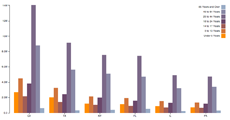
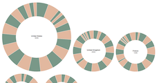
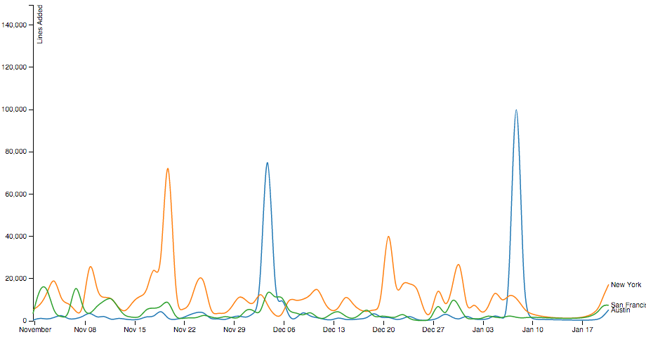

# Gallery

This gallery shows off some example visualizations that query live, streaming, data using Plywood via the [plywood-proxy](https://github.com/implydata/plywood-proxy).

Click on the thumbnails below to see the Plywood query and the rendering code.  

<table class="gallery">
<tr>
<td>
[**Grouped Bar Chart**](http://bl.ocks.org/vogievetsky/9d3db7aeefd23694f052)

</td>
<td>
[**Sized Donut Multiples**](http://bl.ocks.org/vogievetsky/30b764fa39d178be423e)

</td>
</tr>
<tr>
<td>
[**Multi Line Chart**](http://bl.ocks.org/vogievetsky/0031106e42675a18fa8a)

</td>
<tr>
</table>
