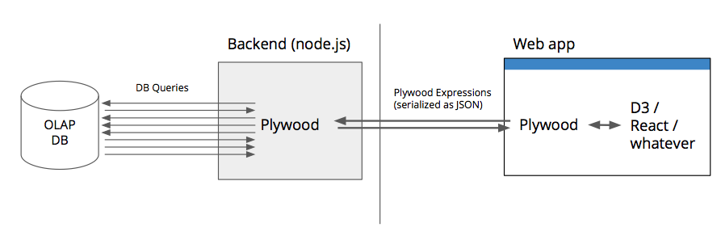
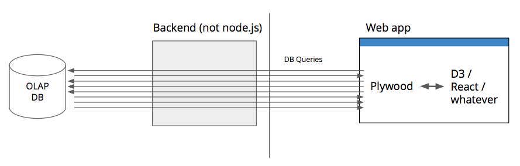
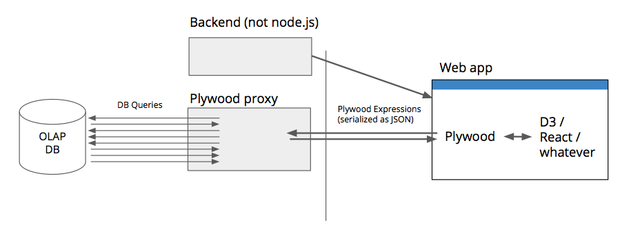
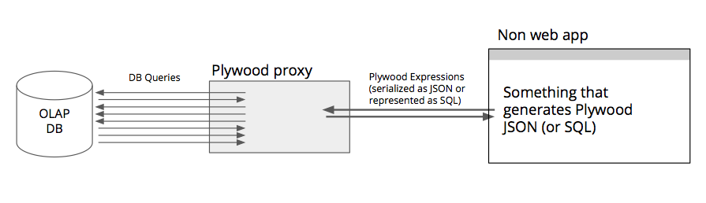
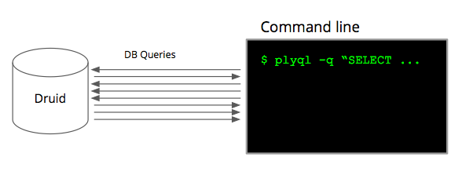

# Plywood

Plywood is a JavaScript library that simplifies building interactive
visualizations and applications for large data sets. Plywood acts as a
middle-layer between data visualizations and data stores.

Plywood is architected around the principles of nested
[Split-Apply-Combine](http://www.jstatsoft.org/article/view/v040i01/v40i01.pdf),
a powerful divide-and-conquer algorithm that can be used to construct all types
of data visualizations. Plywood comes with its own [expression
language](docs/expressions.md) where a single Plywood expression can
translate to multiple database queries, and where results are returned in a
nested data structure so they can be easily consumed by visualizaton libraries
such as [D3.js](http://d3js.org/). 

You can use Plywood in the browser and/or in node.js to easily create your own
visualizations and applications. For an example application built using
Plywood, please see [Pivot](https://github.com/implydata/pivot).

## Should you use Plywood?
 
Here are some possible usage scenarios for Plywood:

### You are building a web-based, data-driven application, node.js backend
 
Plywood primitives can serve as the 'models' for the web application.
The frontend can send JSON serialized Plywood queries to the backend. 
The backend uses Plywood to translate Plywood queries to database queries as well as doing permission management and access control by utilizing Plywood heleprs.



[Pivot](https://github.com/implydata/pivot) is an example of a Project that uses Plywood in this way.

### You are building a web-based, data-driven application, backend not node.js

Plywood can run entirely from the browser as long as there is a way for it to issue queries from the browser.



It might be undesirable to have the web app communicate with the DB in which case you could also use the [Plywood proxy](https://github.com/implydata/plywood-proxy) like so:



### You are building a data-driven application and you are allergic to JavaScript

If JavaScript does not fit into your stack you can still benefit from Plywood by utilizing the Plywood proxy.
Your application could ether generate Plywood queries in their JSON form or as PlyQL strings that it sends over to the Plywood proxy.
The Plywood proxy will send back nested JSON results.
   

   
### You know SQL and want to query a DB that does not use SQL (like Druid)   
   
Maybe all you want is to have a SQL-like interface to Druid. You can use the [PlyQL](https://github.com/implydata/plyql) command line utility to talk to Druid.




## Installation

To use Plywood from npm simply run: `npm install plywood`.

Plywood can be also used by the browser.

## Learn by Example

### Example 0

Here is an example of a simple plywood query that illustrates the different ways by which expressions can be created:

```javascript
var ex0 = ply() // Create an empty singleton dataset literal [{}]
  // 1 is converted into a literal
  .apply("one", 1)

  // The string "$one + 1" is parsed into an expression
  .apply("two", "$one + 1")

  // The method chaining approach is used to make an expression
  .apply("four", $("two").multiply(2))
```

Calling ```ex0.compute()``` will return a [Q](https://github.com/kriskowal/q) promise that will resolve to:

```javascript
[
  {
    one: 1
    two: 2
    four: 4
  }
]
```

This example employs three functions:

* `ply()` creates a dataset with one empty datum inside of it. This is the base of many plywood operations.

* `apply(name, expression)` evaluates the given `expression` for every element of the dataset and saves the result as `name`.


### Example 1

First of all plywood and its component parts need to be imported into the project.
This example will use Druid as the data store:

```javascript
// Get the druid requester (which is a node specific module)
var druidRequesterFactory = require('plywoodjs-druid-requester').druidRequesterFactory;

var plywood = require('plywood');
var Dataset = plywood.Dataset;
```

Next, the druid connection needs to be configured:

```javascript
var druidRequester = druidRequesterFactory({
  host: '10.153.211.100' // Where ever your Druid may be
});

var wikiDataset = Dataset.fromJS({
  source: 'druid',
  dataSource: 'wikipedia',  // The datasource name in Druid
  timeAttribute: 'time',  // Druid's anonymous time attribute will be called 'time'
  requester: druidRequester
});
```

Once that is up and running a simple query can be issued:

```javascript
var context = {
  wiki: wikiDataset
};

var ex = ply()
  // Define the dataset in context with a filter on time and language
  .apply("wiki",
    $('wiki').filter($("time").in({
      start: new Date("2015-08-26T00:00:00Z"),
      end: new Date("2015-08-27T00:00:00Z")
    }).and($('language').is('en')))
  )

  // Calculate count
  .apply('Count', $('wiki').count())

  // Calculate the sum of the `added` attribute
  .apply('TotalAdded', '$wiki.sum($added)');

ex.compute(context).then(function(data) {
  // Log the data while converting it to a readable standard
  console.log(JSON.stringify(data.toJS(), null, 2));
}).done();
```

This will output:

```javascript
[
  {
    "Count": 308675,
    "TotalAdded": 41412583
  }
]
```

A dataset with a single datum in it.
The attribute of this datum will be the `.apply` calls that we asked Druid to calculate.

This might not look mind blowing but we can build on this concept.

### Example 2

Using the same setup as before we can issue a more interesting query:

```javascript
var context = {
  wiki: wikiDataset
};

var ex = ply()
  .apply("wiki",
    $('wiki').filter($("time").in({
      start: new Date("2015-08-26T00:00:00Z"),
      end: new Date("2015-08-27T00:00:00Z")
    }))
  )
  .apply('Count', $('wiki').count())
  .apply('TotalAdded', '$wiki.sum($added)')
  .apply('Pages',
    $('wiki').split('$page', 'Page')
      .apply('Count', $('wiki').count())
      .sort('$Count', 'descending')
      .limit(6)
  );

ex.compute(context).then(function(data) {
  // Log the data while converting it to a readable standard
  console.log(JSON.stringify(data.toJS(), null, 2));
}).done();
```

Here a sub split is added. The `Pages` attribute will actually be a dataset that represents the data in `wiki`
split on the `page` attribute (labeled as `'Page'`) and then the top 6 pages will be taken by applying a sort
and limit.

The output will look like so:

```javascript
[
  {
    "Count": 573775,
    "TotalAdded": 124184252,
    "Pages": [
      {
        "Page": "Wikipedia:Vandalismusmeldung",
        "Count": 177
      },
      {
        "Page": "Wikipedia:Administrator_intervention_against_vandalism",
        "Count": 124
      },
      {
        "Page": "Wikipedia:Auskunft",
        "Count": 124
      },
      {
        "Page": "Wikipedia:Löschkandidaten/26._Februar_2013",
        "Count": 88
      },
      {
        "Page": "Wikipedia:Reference_desk/Science",
        "Count": 88
      },
      {
        "Page": "Wikipedia:Administrators'_noticeboard",
        "Count": 87
      }
    ]
  }
]
```
